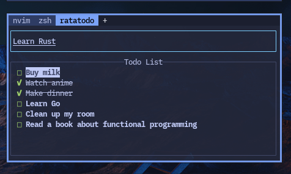

# ✅️ ratatodo

An implementation of a async and event-driven sample todo application with [ratatui](https://ratatui.rs) and [crossterm](https://docs.rs/crossterm/latest/crossterm/)

## Features

- [x] View todo entries 
- [x] Moving cursor
- [x] Delete current todo entry
- [x] Load/Save todo data
- [ ] Add and Edit todo entries with textarea

